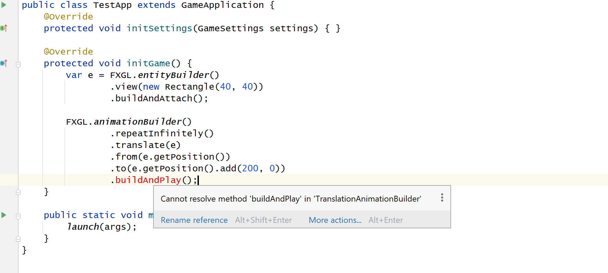

## IntelliJ-FXGL
A possible (UI?) bug.

### How to reproduce

1. Using IntelliJ, import the project as "Maven".
2. Open TestApp.java in the editor, you should see something like this, indicating an error:



3. However, you can run `TestApp` in the editor as normal, without any issues.

### Notes

* The source code of the library in question (FXGL), and specifically the function `buildAndPlay` and everything related to `AnimationBuilder`, is here: [buildAndPlay](https://github.com/AlmasB/FXGL/blob/bdb0005428329528e4202563c152e4afe913e5b6/fxgl-core/src/main/kotlin/com/almasb/fxgl/animation/AnimationBuilder.kt#L248)
* `File | Invalidate Caches | Invalidate and Restart` does not work for this case.

### Version Info

```
IntelliJ IDEA 2021.3 (Community Edition)
Build #IC-213.5744.223, built on November 27, 2021
Runtime version: 11.0.13+7-b1751.19 amd64
VM: OpenJDK 64-Bit Server VM by JetBrains s.r.o.
Windows 10 10.0
GC: G1 Young Generation, G1 Old Generation
Memory: 4096M
Cores: 12

Kotlin: 213-1.5.10-release-949-IJ5744.223
```